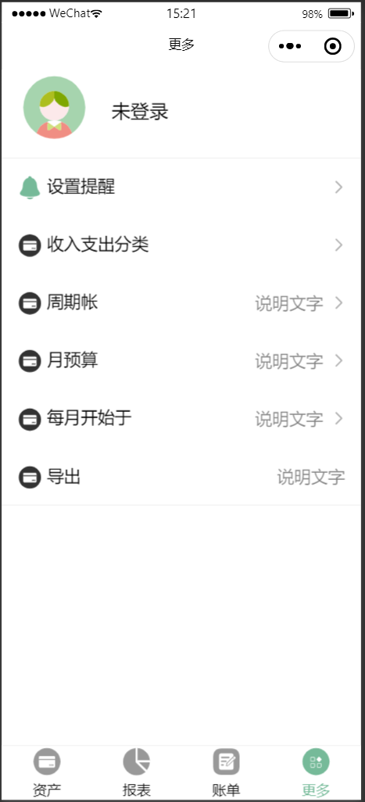
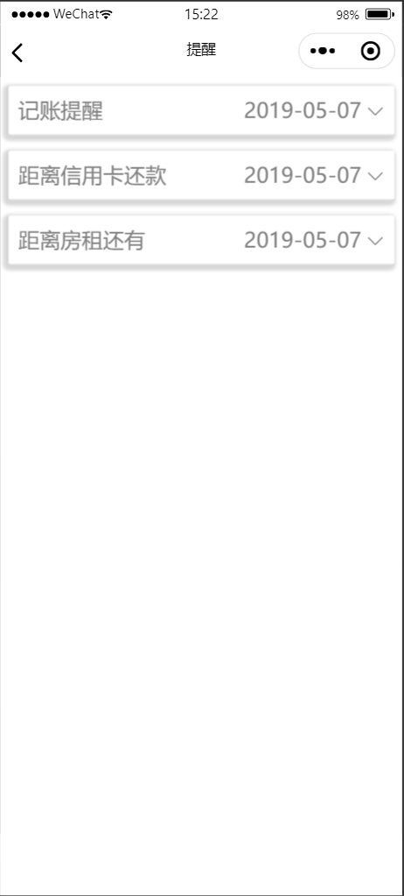
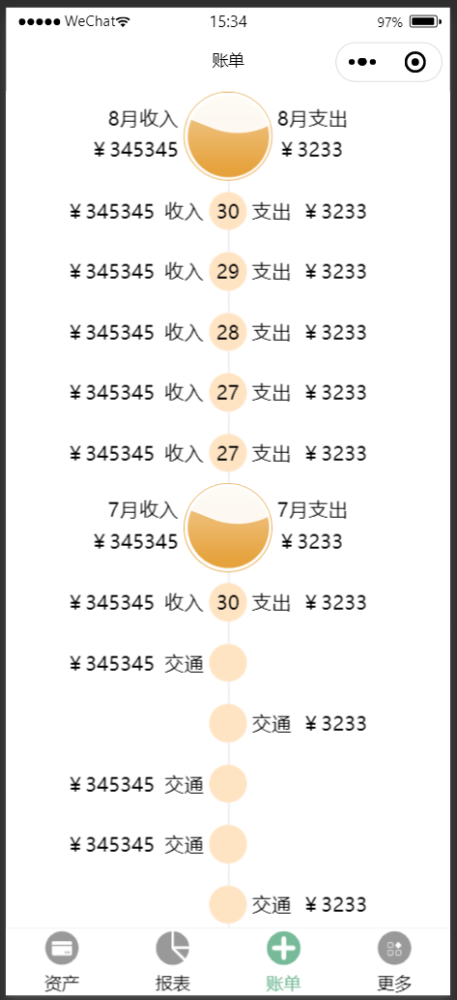
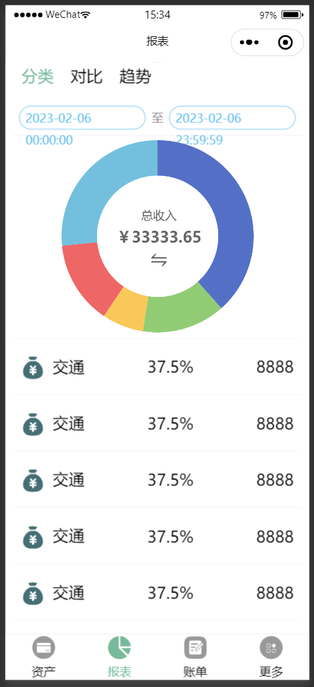
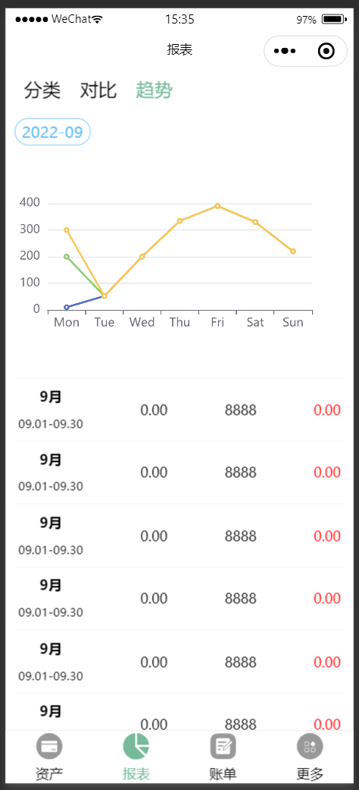

# account_bill
个人记账软件（只写了一部分页面，没有完成，已废弃）

色彩配色   #76BA99           #ADCF9F           #CED89E           #FFDCAE
          RGB(111,186,153)  RGB(173,207,159)  RGB(206,216,158)  RGB(255,220,174)

# 使用iconfont的Symbol类型

> 在学习做微信小程序时，有需求要引用到大量iconfont彩色图标，因为我们一般用的都是iconfont单色图标，直接导入它的css文件就OK了，但是在使用彩色图标话，需要用到Symbol类型，会发现微信小程序不支持svg

## 第一步：安装插件   ---   mini-program-iconfont-cli

在根目录中打开命令窗口，npm/yarn/cnpm你随意

可以查看mini-program-iconfont-cli，里面也有详细解说哦

// Yarn

`yarn add mini-program-iconfont-cli --dev`
 
// Npm

`npm install mini-program-iconfont-cli --save-dev`
## 第二步：生成配置文件

先执行npx iconfont-init命令，不然的话会报错，提示没有iconfont.json文件   ---   如果你只输入npx iconfont   ---   回车会提示你相关命令供选择

`npx iconfont-init` 或者 `npx iconfont-wechat`

这个时候项目根目录会生成一个iconfont.json文件

部分参数说明（）：

`symbol_url`   ---   复制iconfont官网你的项目的Symbol链接

`trim_icon_prefix："icon"`   ---   图标前缀省略，一般的iconfont图标前缀都有一个"icon"，我们到时候引用的时候可以去省略，我一般会修改为"icon-"

## 第三步：修改symbol_url的值

修改iconfont.json文件中symbol_url的参数

## 第四步：生成小程序组件
-wechat是支持微信小程序的

`npx iconfont-wechat`

可以看到自己的根目录中生成了iconfont目录   ---   全局图标组件

## 第五步：注册iconfont组件并使用

注册：可以在app.json文件中引入全局图标组件，避免每个page都去引入，这样就麻烦。

// 绝对路径

    {
        "usingComponents": {
            "iconfont": "/iconfont/iconfont"
        }
    }
 使用：在.wxml文件中去使用

 注意：在根目录下的iconfont.json文件中省略了图标前缀"icon-"

`<iconfont name="icon_salary"></iconfont>`

### 补充1：修改iconfont图标大小

一般引用成功后，图标大小可能不是我们想要的效果，在.wxss文件中去修改样式会不成功，每个iconfont图标的宽高都受到iconfont.js文件（这里是iconfont目录下的iconfont.js文件）中的data里面的svgSize的影响，默认值是18

### 补充2：更新iconfont项目中的图标后

如果iconfont项目中你的图标修改了，那么需要去更新你的Symbol链接，并更新参数symbol_url，

再执行

`npx iconfont-wechat`

## 目前效果

